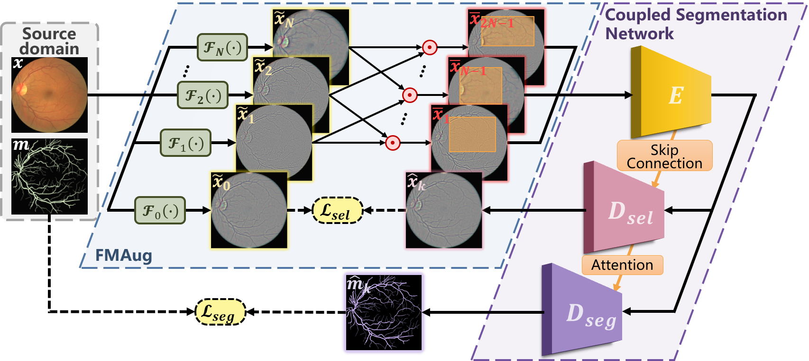
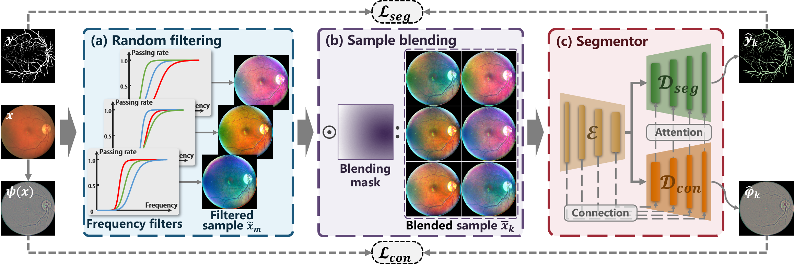

# Frequency-mixed Single-source Domain Generalization for Medical Image Segmentation

This repository contains the official implementation of [Frequency-mixed Single-source Domain Generalization for Medical Image Segmentation](https://arxiv.org/abs/2307.09005). This work has been accepted by MICCAI 2023.



# RaffeSDG: Random Frequency Filtering enabled Single-source Domain Generalization for Medical Image Segmentation

This repository contains the official implementation of [RaffeSDG: Random Frequency Filtering enabled Single-source Domain Generalization for Medical Image Segmentation]().



## Datasets

In the fundus vessel segmentation task, the training set DRIVE is available at [DRIVE](https://drive.grand-challenge.org/).
The first test set LESAV is available at [LESAV](https://figshare.com/articles/dataset/LES-AV_dataset/11857698).
The second test set IOSTAR is available at [IOSTAR](http://www.retinacheck.org/download-iostar-retinal-vessel-segmentation-dataset).
The data used for the orthopedic ultrasound image segmentation task is sourced from private data obtained through collaboration with our cooperated hospital. Due to copyright restrictions, we are unable to disclose this data publicly.
All of the above datasets should be organized in the following structure:

```
<root_name>
- 0
    - image.png
    - label.png
    - mask.png
- 1
- 2
...
```

## Dependencies

* torch>=0.4.1
* torchvision>=0.2.1
* dominate>=2.3.1
* visdom>=0.1.8.3

## Training

Before running the training code, you need to start the visdom server by running the following command:

```
python -m visdom.server -p <some free port> --host 0.0.0.0
```

The training command of FreeSDG is as follows:

```
python procedure_freesdg/train.py --dataroot <your training set directory> --gpu_ids <gpu id> --display_port <visdom port> --name freesdg --model freesdg_segmentation --lr 0.001 --n_epochs 20 --preprocess flip --print_freq 10 --display_freq 40 --save_epoch_freq 1 --n_epochs_decay 30 --sample_repeat 10 --no_dropout --netG unet_combine_2layer_attention --input_nc 3 --output_nc 1 --load_size 512 --dataset_mode online_fact --norm instance --batch_size 2 --do_mixup --mixup_size -1 --no_fact
```

The training command of RaffeSDG is as follows:

```
python procedure_raffesdg/train.py --dataroot <your training set directory> --gpu_ids <gpu id> --display_port <visdom port> --lr 0.001 --n_epochs 10 --preprocess flip --print_freq 10 --display_freq 40 --save_epoch_freq 1 --n_epochs_decay 10 --name raffesdg --model raffesdg_segmentation --netG unet_mo --input_nc 3 --output_nc 1 --load_size 512 --dataset_mode online_fact --norm instance --batch_size 2 --mixup_type smooth --mixup_remain_original --time_prefix --lambda_high 1.0 --do_mixup --dropout_type 2 --reconstruction_loss MSELoss --second_attention --attention_type CABlock --drop_last
```

## Acknowledgment
This work was supported in part by Basic and Applied Fundamental Research Foundation of Guangdong Province (2020A1515110286), the National Natural Science Foundation of China (82102189), Guangdong Provincial Department of Education (2020ZDZX3043), Guangdong Provincial Key Laboratory (2020B121201001), Shenzhen Natural Science Fund (JCYJ20200109140820699, 20200925174052004), Shenzhen Science and Technology Program (SGDX202111 23114204007), A * STAR AME Programmatic Funding Scheme Under Project A20H4b0141, and A * STAR Central Research Fund.

## Citation

If you find our works useful for your research, please cite our paper:

```
@inproceedings{li2023frequency,
  title={Frequency-mixed Single-source Domain Generalization for Medical Image Segmentation},
  author={Li, Heng and Li, Haojin and Zhao, Wei and Fu, Huazhu and Su, Xiuyun and Hu, Yan and Jiang, Liu},
  booktitle={Medical Image Computing and Computer Assisted Intervention--MICCAI 2023: 26th International Conference, Vancouver, Canada, October 8--12, 2023, Proceedings},
  pages={1--5},
  year={2023},
  organization={Springer}
}
```


